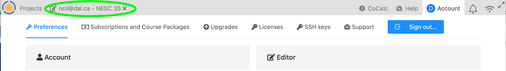
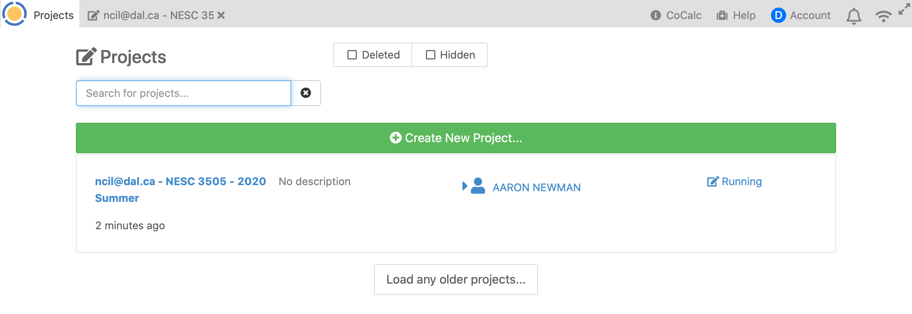

# Assignment 1
## NESC 3505

Welcome to your first assignment for NESC 3505! The goal of this assignment is simply to get you oriented to the course and its various tech components.

## Teams

If you are reading this, then you have likely figured out how to get onto Teams. Congrats! There is a section in the Getting Started section of the textbook with some info on Teams. And of course, you can always Google any question you have about Teams.

Teams is your "home base" for this course and you should be checking in there on a daily basis to keep track of any announcements, updates, etc., as well as using it to access all the course material.

**Assignment task:** post a message in the General channel in Teams, saying hello!

## DataCamp

The teaching team will add you to DataCamp using your @dal.ca netID. You will get an invitation link from DataCamp to finish setting up your account. Note that if you sign up to DataCamp using a different email address you will not have the free access granted by this course.

Your "home base" on DataCamp is the Assignments page:

From here you can click on assignments to start them.

However, sometimes you may get lost navigating DataCamp. In particular, if you click on your avatar (the circle with the "A" in the top right corner of the screenshot above), you'll see "DataCamp Home" which will take you to the wider world of DataCamp. You're welcome to explore there, although it's beyond what you need for the class. If you do explore, you may find it confusing to get back to the class assignment listing. To do so, click on "Organizations" in the left menu bar of DataCamp Home, and it will take you back.

**Assignment task:** Log on to DataCamp, get your account set up.

## CoCalc

You will also receive an email inviting you to sign up on CoCalc. When you follow this link, you'll want to use the "Create Account" box on the left side of the window, and you need to click the "I agree to the Terms of Service" box before you can create an account. Sign up using your @dal.ca netID email address. Don't click one of the social media icons or try to sign up using something other than your Dal.ca account. Use your real first and last names (this info is not public; it's visible only inside our class project), and choose a secure password.

Once you're logged in, you see a screen like the one below.

**Assignment task:** *Click on "Account" in the top right corner of the CoCalc window. This will open your account settings. Explore this a little. We encourage everyone to add an avatar picture. If you already use the Gravatar or Adorable services, you can link to these, or you can "Choose File" to upload a picture of your choosing.*

*You can also play around with other settings like Dark Mode. However, it's not advisable to change any settings you don't understand!*

To get out of your account settings, click the tab in the top left (-ish) corner as shown with eh green circle below.

Click on the link for the course with the term you're registered for (e.g., 2020 Summer). Everything for the course will take place within this "Project".

Once you're in the project, across the top you'll see a few tabs, as shown below: Files, New, Log, Find, and Settings. Below this, you'll see a file browser, probably with just the Assignments folder. Inside there, you'll find sub-folders for each assignment (they may not all appear yet). Navigate to the `Assignment_1` folder.

## Your First Jupyter Notebook!
